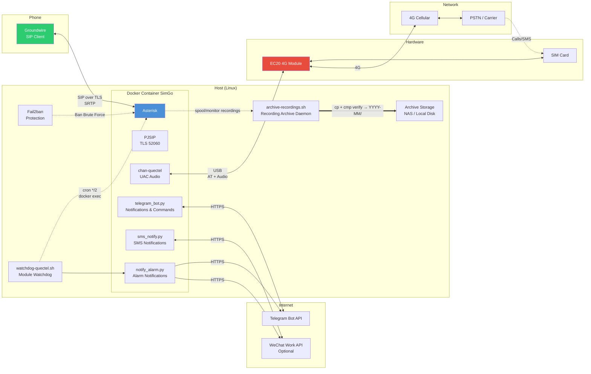

# SimGo

> Remote phone calls and SMS from anywhere — Containerized EC20 + Asterisk relay system

English | [中文](README.md)

[](LICENSE)

> [!WARNING]
> **Legal Disclaimer**
>
> This project is intended for personal learning and research purposes only. It is limited to the deployer using their own SIM card registered under their real name, for personal use only to remotely access their own phone number.
>
> **The following uses are strictly prohibited:**
> - Providing telephone relay services to third parties
> - Renting or reselling this service
> - Setting up public VOIP / SIP relay services
> - Using for any illegal activities
>
> In accordance with Article 14 of the Anti-Telecommunications Network Fraud Law of the People's Republic of China, it is prohibited to illegally manufacture, sell, or provide equipment or software with the function of illegally connecting internet telephone calls to public telecommunications networks. Providing telephony voice relay services requires a national telecommunications business license, which individuals do not qualify for.
>
> Users who violate laws and regulations bear full responsibility for their actions, and the project author is not responsible. The author assumes no legal liability for any misuse.
>
> If this project is discovered to be used for illegal purposes, the author will actively cooperate with relevant authorities for lawful enforcement.

## Why

eSIM support in China is limited — changing SIM cards requires a carrier visit, and often fails. iPhones in China can only hold 2 eSIM profiles, making it impossible to add a 3rd when traveling abroad. iPhone Duo and future Apple ultra-thin models will drop dual physical SIM slots entirely, switching to dual eSIM.

SimGo solves this by plugging a SIM card into a Quectel EC20 4G module connected via USB to a Linux host (Raspberry Pi, mini PC, NAS). Run a containerized Asterisk service, install a SIP client (like Groundwire) on your phone with just a data SIM, and you can make/receive calls and send/receive SMS from anywhere.

Since iOS doesn't receive Telegram push notifications in China, SimGo supports WeChat Work (optional) as a fallback notification channel.

## Why Containerize

Different Linux distros ship vastly different Asterisk versions, and compiling chan-quectel manually often breaks. Containerization:

- **Eliminates system differences**: Runs on Ubuntu / Debian / Armbian / OpenWrt
- **One-click deploy**: No manual Asterisk installation or driver compilation
- **Clean separation**: Config files stay isolated from the host system
- **Easy maintenance**: Upgrade, rollback, backup — all straightforward

## Features

- **Remote calls & SMS**: SIM in a home host (Raspberry Pi / mini PC / NAS) — make/receive calls and send/receive SMS from anywhere
- **Automatic call recording (optional)**: Records both directions, starts after the call is answered. Filenames use contact names; files are byte-verified (`cp` + `cmp`) and archived monthly (`YYYY-MM/`) to a persistent directory such as a NAS (or kept local only). Retention: delete-after-archive / keep N days / size cap. See [Call recording and archiving](#call-recording-and-archiving)
- **TLS/SRTP encryption**: PJSIP over TLS (port 52060) + SRTP media encryption
- **Notifications**: Calls & SMS pushed to Telegram (WeChat Work as fallback), bot supports remote commands
- **Fail2ban protection**: Auto-bans SIP brute-force IPs (nftables)
- **One-command setup**: setup.sh initializes DuckDNS TLS certificates, fail2ban, recording archiver and log rotation
- **Module watchdog (self-healing)**: Monitors EC20 driver state anomalies and recovers them automatically (soft reset → hard reboot); optionally notifies Telegram and WeChat Work on failure/recovery. See [Module watchdog (self-healing)](#module-watchdog-self-healing)

## Architecture



## Hardware Requirements

### EC20 Module

Specific model used: **EC20CEHDLGR08A03M1G**

> **Note**: Developed and tested on this model. Other EC20 variants (e.g. EC20CEFAG-512-SGNS) may have compatibility differences. Verify before purchasing.

**Purchase tips**:
- Search "EC20 USB adapter board" on Xianyu (闲鱼), ~60 CNY (module + adapter + antenna)
- Recommended: **EC20CEFAG** full-featured version (supports calls and SMS, though full compatibility with this project is not guaranteed)
- Confirm firmware is **R08 baseline** (`EC20CEFAGR08AXXM4G`) — R06 baseline has poor support for newer China Telecom SIMs
- Included antennas are usually weak; consider buying a longer one

### Host Machine

- Linux (Ubuntu / Debian / Armbian, etc.)
- 24/7 operation (Raspberry Pi 4+, Orange Pi, x86 mini PC, etc.)
- Docker & Docker Compose
- Sufficient USB power (**recommend independent power supply** for the module, not just Pi USB port, especially Pi 3 and earlier)

## Module Initialization

Before deploying SimGo, initialize the EC20 module. **This must be done manually**.

### Step 1: Find the AT Command Port

EC20 creates multiple ttyUSB devices when connected via USB:

| Port | Purpose |
|------|---------|
| ttyUSB0 | Diagnostics |
| ttyUSB1 | Audio/GPS |
| **ttyUSB2** | **AT commands (usually)** |
| ttyUSB3 | Dial-up |

> **Note**: ttyUSB2 is the most common AT port, but may vary by hardware/firmware.

```bash
# List USB serial devices
ls /dev/ttyUSB*

# Test AT command response (try each one)
echo -e "AT\r" > /dev/ttyUSB2
timeout 2 cat /dev/ttyUSB2
# Should return OK
```

### Step 2: Reset the Module

Connect to the AT port using minicom:

```bash
minicom -D /dev/ttyUSB2
```

Enter these commands in minicom:

```
AT+QPRTPARA=3
```

Wait for reset to complete, then enter:

```
AT+CFUN=1,1
```

The module will restart. Wait ~30 seconds before reconnecting minicom.

### Step 3: Configure UAC Digital Audio

UAC digital audio significantly improves call quality. In minicom:

```
AT+QCFG="usbcfg",0x2C7C,0x0125,1,1,1,1,1,0,1
```

After restarting the module (`AT+CFUN=1,1`), verify the audio device on the host:

```bash
# Option 1: if alsa-utils is installed
aplay -L

# Option 2: no extra packages needed
cat /proc/asound/cards
ls /dev/snd/
```

You should see something like:

```
hw:CARD=EC20CEHDLG,DEV=0     EC20CEHDLG, USB Audio
```

**Note this device name** — you'll need it during deployment.

### Step 4: Configure VoLTE

VoLTE improves voice call quality:

```
AT+QCFG="ims",1        # Enable VoLTE
AT+QCFG="ims"          # Check status, should show "ims",1,1
```

### Step 5: Restart After Configuration

```
AT+CFUN=1,1
```

### Step 6: Exit minicom

Press `Ctrl-A`, then `X`, select `Yes` to exit.

### Step 7: Confirm EC20 by-id Device Path

docker-compose uses by-id paths to prevent USB port drift:

```bash
ls -l /dev/serial/by-id/
```

Find the entry containing `Quectel` and `EC20`, note the full path, e.g.:

```
usb-Quectel_Wireless_EC20-if02 -> ../../ttyUSB2
```

The `usb-Quectel_Wireless_EC20-if02` part is the AT port path you'll need during deployment. The number may differ depending on USB topology.

## Deployment

### Prerequisites

- Docker and Docker Compose installed
- EC20 module initialized (steps above)
- Telegram Bot created (via [@BotFather](https://t.me/BotFather))
- A DuckDNS domain registered and its Token (free at [duckdns.org](https://www.duckdns.org/); create a subdomain in the DuckDNS console and copy the token)

### Quick Deploy

```bash
git clone https://github.com/myleo1/SimGo.git
cd SimGo
chmod +x setup.sh
./setup.sh
```

The setup script will guide you through:

1. **AT command port** (by-id path from Step 7)
2. **ALSA audio device** (auto-detected)
3. **PJSIP username and password** (strong password required, 32+ chars recommended)
4. **Local network subnet** (CIDR, e.g. `192.168.1.0/24`)
5. **Public IP or domain** (DuckDNS domain, e.g. `your-domain.duckdns.org`)
6. **Telegram Bot Token and Chat ID**
7. **SOCKS5 proxy** (optional, usually needed for TG API access in China)
8. **WeChat Work config** (optional, requires [wechat-work-pusher](https://github.com/myleo1/wechat-work-pusher) server)
9. **DuckDNS Token** (for TLS certificate issuance and IP auto-update)
10. **Let's Encrypt email** (for acme.sh account registration)
11. **Call recording & archiving** (optional): enable/disable automatic recording, recording format (`wav49`/`ulaw`), persistent archive directory, local retention policy

The script generates:
- `docker-compose.yml`
- Config files (PJSIP, Quectel, Telegram Bot, etc.)
- TLS certificates (Let's Encrypt via DuckDNS)
- `duckdns-update.sh` (DuckDNS IP auto-update cron, every 5 minutes)
- `.simgo-archive.conf` (recording archive config)
- `spool/contacts.csv` (contact mapping, editable)
- `spool/monitor/` (local recording staging directory)
- Recording archive cron: `@reboot` starts the watch daemon + a 5-minute fallback scan

Then start the service:

```bash
docker compose up -d
```

View logs:

```bash
docker compose logs -f
```

You're good when you see `Telegram SMS bot started` and `Asterisk Ready`.

### Pre-built Image (Optional)

Pull from GitHub Container Registry instead of building locally:

```bash
# Latest version (public repo, no login needed)
docker pull ghcr.io/myleo1/simgo:latest

# Or specific version
docker pull ghcr.io/myleo1/simgo:1.6.1
```

Then replace the `build` section in `docker-compose.yml` with:

```yaml
services:
  simgo:
    image: ghcr.io/myleo1/simgo:latest
```

### GitHub Actions Auto-Build

Pushing a `v*` tag triggers multi-arch build (amd64 + arm64) and publish to GitHub Container Registry:

```bash
git tag v1.0.0
git push origin v1.0.0
```

Forked repos can also trigger builds manually from the Actions page.

## Configuration

### Notification Channels

| Variable | Description | Required |
|----------|-------------|----------|
| `TG_BOT_TOKEN` | Telegram Bot Token | Yes |
| `TG_CHAT_ID` | Telegram Chat ID | Yes |
| `TG_SOCKS5_PROXY` | SOCKS5 proxy | No (recommended in China) |
| `WECHAT_WORK_API` | WeChat Work API URL | No |
| `WECHAT_WORK_TOKEN` | WeChat Work Token | No |
| `WECHAT_WORK_TO` | WeChat Work recipient | No |

> **WeChat Work**: Optional fallback notification channel for iOS users in China who can't receive Telegram push notifications. See [wechat-work-pusher](https://github.com/myleo1/wechat-work-pusher) for server deployment.

### PJSIP Configuration

| Variable | Description |
|----------|-------------|
| `PJSIP_EXTEN` | SIP username (set during deployment) |
| `PJSIP_SECRET` | SIP password (set during deployment) |

### Security

SimGo enables TLS and SRTP by default:

- **SIP signaling encryption**: PJSIP over TLS (port 52060)
- **Media stream encryption**: SRTP (encrypted voice data)
- **TLS certificates**: Auto-issued via DuckDNS + acme.sh (Let's Encrypt, no port 80 needed)
- **Fail2ban protection**: Auto-bans SIP brute-force IPs (nftables, TCP+UDP all ports)

> Deployment requires a DuckDNS domain and Token ([duckdns.org](https://www.duckdns.org/) — free registration). The script auto-installs acme.sh and handles certificate issuance.

**⚠️ Strong password required**: The PJSIP password is the only authentication credential for the public SIP service. Use a strong password (32+ random characters). Use a prefix + random string for the username (e.g. `gw_7Kx92mQ4`), avoid numeric extensions like `1001` or `1000`.

## Call Recording and Archiving

### Enable / Disable

You choose whether to enable automatic recording during deployment (setup.sh), **enabled by default**. To turn it off/on after deployment, change the `RECORDING_ENABLED` environment variable in `docker-compose.yml` to `no` / `yes`, then rebuild the container with `docker compose up -d` — no dialplan changes needed. When disabled, the recording infrastructure (archive cron, contact table, format setting) stays intact, so switching back to `yes` restores recording.

### Recording Formats

Phone / EC20 audio is natively **8kHz narrowband** — sampling above 8kHz is pointless. Choose during deployment:

| Format | Codec | ~Per minute | Notes |
|--------|-------|-------------|-------|
| `wav49` (default) | GSM in WAV | ~100 KB | Optimized for telephone voice, best player compatibility |
| `ulaw` | G.711 8-bit | ~470 KB | No loss at 8kHz bandwidth, larger files |

### Archiving Mechanism

- **Automatic bidirectional recording**: starts only after the call is answered (no ringback/wait tones), stops on hangup
- Recordings first land in the local staging directory `spool/monitor/`, then a host daemon (inotifywait) **byte-verifies** (`cmp`) and archives to the persistent archive directory, organized monthly (`YYYY-MM/`)
- Leave the archive directory empty (during deployment) = no archiving, recordings stay local only
- **Persistent archive directory suggestion**: a NAS share mounted on the host (NFS / SMB / WebDAV mount point) or a large local disk directory

> **Why not write directly to the archive from the container?** If the archive is a NAS mount, it may not be ready when the container starts (bind mount silently binds an empty directory), and an offline NFS `write()` can block calls forever. So recordings always go to local disk first; the host daemon handles archiving. If archive storage is unavailable it's skipped and re-synced within 5 minutes after recovery.

### Local Retention Policy

What happens to local recordings after a successful archive (chosen during deployment):

| Mode | Behavior |
|------|----------|
| A (default) | Delete local immediately — archive is the only copy |
| B | Keep locally for N days (backup copy) |
| C | Cap local size at N MB (oldest deleted first when over) |
| B+C | Clean when either condition triggers |

### Contact Naming (Optional)

`spool/contacts.csv` (UTF-8, `number,name` per line) maps numbers to names in recording filenames. Unmapped numbers fall back to the number itself. Example: `20260911-153045_in_ZhangSan_13800138000.wav49`

Maintain it two ways:
1. **Edit manually** `spool/contacts.csv` (see the `config/contacts.csv.example` template)
2. **Import from iPhone contacts** (one-time; works with vCard exports from both Apple and Android, auto-generates `+86`-stripped variant rows for mobile number ranges to improve matching):
   - Export contacts as vCard (`.vcf`) from [iCloud Contacts](https://www.icloud.com/contacts) on a computer (select all → export vCard)
   - Run: `python3 scripts/vcard_to_csv.py your-contacts.vcf`
   - Default output overwrites `<deploy-dir>/spool/contacts.csv`

> Archive logs & troubleshooting: `logs/recordings-archive.log`. Uninstalling SimGo deletes local recordings and the contact table — **the archive directory is unaffected**.
>
> `logs/` is rotated daily on the host by `logrotate`: 7 copies for the recording archive log and 14 copies for Asterisk (`messages.log` / `queue_log`), gzip-compressed (config `/etc/logrotate.d/simgo`, removed on uninstall).

## Module Watchdog (Self-Healing)

### Why

The chan-quectel driver decides device readiness from **either the GSM-domain (+CREG) or the LTE-domain (+CEREG) registration** (fixed upstream). When the signal is weak or re-camping causes brief fluctuation, both domains may drop simultaneously; the driver then reports `GSM not registered` and blocks calls — a genuine loss of registration, not a false positive. The watchdog polls the driver state every two minutes, recovers anomalies automatically in stages, and optionally notifies on failure/recovery.

### Automatic recovery

- Checks **every** possible `State:` value of `quectel show device state` and classifies it: registration / initialization / link-layer failures each get a light-to-heavy recovery chain:
  - Registration failure: `quectel reset` (re-initialize driver) → if still failing → `AT+CFUN=1,1` (module reboot)
  - Initialization failure: `quectel reset` only
  - Link-layer failure: `quectel restart now` only
- Requires 2 consecutive failing polls before acting (debounce); never acts while a call is active; 30-minute cool-down after an action; max 5 actions per device per day
- States that carry a `scheduled` suffix (SIM removed, manual stop, etc. — meaning `desired != current` while the driver is switching states) are **skipped** on purpose, to avoid interfering with the driver's own self-healing
- State is persisted under `scripts/.watchdog-state/`; diagnostics go to `logs/watchdog-quectel.log` (rotated daily, 7 copies)

### Notifications (optional)

One notification each on failure trigger, escalation and recovery, using the [notification channels](#notification-channels) below:

- **Telegram**: sent when `TG_BOT_TOKEN` is configured
- **WeChat Work**: sent as a fallback when all three `WECHAT_WORK_*` variables are configured
- If neither channel is configured, logs only
- During a driver state switch (SIM pulled / manual stop, `State:` carrying a `scheduled` suffix) the watchdog **stays hands-off** and raises a **one-shot** notice "possible SIM removal or manual action"; the marker auto-resets after recovery, so it can notify again next time

> If `GSM not registered` fires frequently, it usually means weak signal: start by optimizing antenna placement / coverage. The watchdog is a safety net — stable signal keeps false alarms to a minimum.

## Usage

### Telegram Bot Commands

| Command | Description |
|---------|-------------|
| `/start` | Open main menu |
| `/help` | Show help |
| `/send <number> <message>` | Send SMS |

Bot features:
- SMS receive notifications (with reply button)
- Incoming call notifications
- Module status check
- Remote module restart

### Groundwire Configuration

#### Why Groundwire

This project requires a SIP client that can receive calls in the background. iOS has strict restrictions:

- **VoIP push mechanism**: iOS VoIP push (PushKit) must be used with CallKit (mandatory since iOS 13). VoIP pushes without CallKit are rejected by the system.
- **CallKit requirements**: Building a custom iOS SIP client requires:
  1. Apple Developer Program membership ($99/year)
  2. **VoIP Services Certificate (.p12)** from Apple Developer Portal
  3. PushKit + CallKit framework integration
  4. Maintaining a persistent background SIP connection

[Groundwire](https://apps.apple.com/app/groundwire-sip-softphone/id397417696) ([Android](https://play.google.com/store/apps/details?id=cz.acrobits.softphone.aliengroundwire)) is a mature commercial SIP client that implements all of this:

- **CallKit integration**: System-level incoming call UI (works on lock screen, background, Do Not Disturb)
- **Persistent background**: Maintains SIP registration, triggers VoIP push via APNs on incoming calls
- **No developer account needed**: No $99/year Apple Developer Program or VoIP certificate required

> If you have iOS development experience and want to build a custom SIP client, refer to Groundwire's CallKit implementation. Note the VoIP Services Certificate (.p12) application and maintenance costs.

1. Create a new SIP account
2. Username: your `PJSIP_EXTEN`
3. Password: your `PJSIP_SECRET`
4. Domain: your DuckDNS domain (e.g. `your-domain.duckdns.org`)
5. Transport Protocol: Account → Advanced Settings → Transport Protocol → **TLS (SIPS)**
6. Port: `52060`
7. SRTP: Account → Advanced Settings → Secure Calls → enable **Incoming Calls** and **Outgoing Calls**
8. Save and wait for registration to succeed

> Groundwire needs to accept the certificate. On first connection, a certificate confirmation prompt will appear — select "Accept".

**Test push notifications**: Groundwire has a built-in push test. Go to Settings → Push Notification, tap the test button. If you see "Push Test incoming call" after a few seconds, CallKit push is working. If not, check Groundwire's background app refresh permission.

**Test incoming calls**: Fully close Groundwire → call the EC20 number from another phone → CallKit triggers → answer directly

### Firewall Rules

If the host has a firewall enabled, allow these ports:

| Port | Protocol | Purpose |
|------|----------|---------|
| 52060 | TCP | PJSIP TLS signaling |
| 42077-42126 | UDP | RTP/SRTP media (50 ports) |

### Test Calls

```bash
# Check module status
docker exec simgo asterisk -rx "quectel show devices"
```

## FAQ

### Q: Groundwire doesn't ring on incoming calls?

1. Test push with Groundwire's built-in test (Settings → Push Notification → test)
2. Confirm Groundwire is registered (status shows Registered)
3. Confirm Groundwire hasn't been killed by iOS (check Background App Refresh is enabled)
4. Check firewall allows 52060/TCP and 42077-42126/UDP

### Q: No audio during calls?

1. Check `/dev/snd` is properly mounted
2. Confirm container runs with `privileged: true`
3. Confirm UAC is configured correctly (`cat /proc/asound/cards` should show the sound card)
4. Check no other process (e.g. PulseAudio) is monopolizing the sound card

### Q: AT command port not found?

Port assignments may vary by module/firmware. Test each one:

```bash
for port in /dev/ttyUSB*; do
    echo "Testing $port..."
    echo -e "AT\r" > $port 2>/dev/null
    timeout 2 cat $port 2>/dev/null
done
```

### Q: Randomly shows "GSM not registered" / calls fail?

The driver decides readiness from **either the GSM-domain (+CREG) or the LTE-domain (+CEREG) registration**. Weak signal or brief re-camping can make both domains drop simultaneously, so the driver reports `GSM not registered` — a genuine loss of registration, not a false positive (verify with `docker exec simgo asterisk -rx "quectel at quectel0 AT+CEREG?"`). The [watchdog](#module-watchdog-self-healing) detects and recovers this automatically and notifies on failure/recovery (if configured); if it fires frequently, improve module signal first (antenna placement / coverage).

## Project Structure

```
SimGo/
├── .github/                # GitHub Actions
│   └── workflows/
│       └── build.yml
├── config/                 # Asterisk config templates
│   ├── pjsip.conf
│   ├── extensions.conf
│   ├── extensions_custom.conf
│   ├── quectel.conf
│   ├── modules.conf
│   ├── rtp.conf
│   └── contacts.csv.example # Contact mapping template (copied to spool/contacts.csv)
├── scripts/                # Notification, bot, recording and watchdog scripts
│   ├── sms_notify.py
│   ├── telegram_bot.py
│   ├── notify_alarm.py     # Alarm notifications (Telegram + WeChat Work, container-side CLI)
│   ├── bot.conf            # Bot config template
│   ├── archive-recordings.sh # Recording archive daemon (--watch/--scan)
│   ├── watchdog-quectel.sh # Module state monitor & self-heal (host side, cron */2)
│   ├── vcard_to_csv.py     # iPhone vCard → contacts.csv import tool
│   └── .watchdog-state/    # Watchdog state counters (runtime, git ignored)
├── docker/                 # Docker files
│   ├── Dockerfile
│   └── docker-compose.yml   # Compose template (setup.sh generates root docker-compose.yml from it)
├── docs/                   # Project documentation
│   ├── REQUIREMENTS.md
│   ├── DESIGN.md
│   ├── TASKS.md
│   ├── PROMPT.md
│   ├── PROMPT-RECORD.md
│   └── PROMPT-WATCHDOG.md
├── start.sh                # Container entrypoint (renders configs + starts Asterisk)
├── setup.sh                # Interactive deploy script
├── uninstall.sh            # Uninstall script
├── certs/                  # Let's Encrypt TLS certificates (generated by setup.sh)
├── duckdns-update.sh       # DuckDNS IP update script (generated by setup.sh, cron */5)
├── docker-compose.yml      # Deployed compose config (generated by setup.sh, git ignored)
├── .simgo-archive.conf      # Recording archive config (generated by setup.sh, git ignored)
├── spool/                  # Runtime data (git ignored)
│   ├── contacts.csv        # Contact mapping (used in recording filenames)
│   └── monitor/            # Local recording staging directory
├── logs/                   # Logs (git ignored, rotated via logrotate)
├── LICENSE                 # GPL v2 license
├── README.md
└── README.en.md
```

## Credits

This project is based on:

- **[myth.cx - Asterisk + EC20 for SMS, Voice Calls, and Proxy](https://myth.cx/p/asterisk-ec20/)** — Core tutorial for EC20 + Asterisk configuration
- **[mccding/NasAnySim](https://github.com/mccding/NasAnySim)** — TLS certificate auto-management (DuckDNS DNS-01 + HTTP-01 + self-signed priority chain)
- **[kafuneri/asterisk-docker-iax](https://github.com/kafuneri/asterisk-docker-iax)** — Docker containerization reference, inspiration for env var injection and template system
- **[IchthysMaranatha/asterisk-chan-quectel](https://github.com/IchthysMaranatha/asterisk-chan-quectel)** — Original chan-quectel driver with UAC digital audio support
- **[missing233/asterisk-chan-quectel-lts](https://github.com/missing233/asterisk-chan-quectel-lts)** — LTS branch with improved UAC media path and stability
- **[myleo1/asterisk-chan-quectel-lts](https://github.com/myleo1/asterisk-chan-quectel-lts)** — Fixed swap hold/unhold bug (dual call scenario)
- **[myleo1/wechat-work-pusher](https://github.com/myleo1/wechat-work-pusher)** — WeChat Work message push server

## License

[GPL v2](LICENSE)
