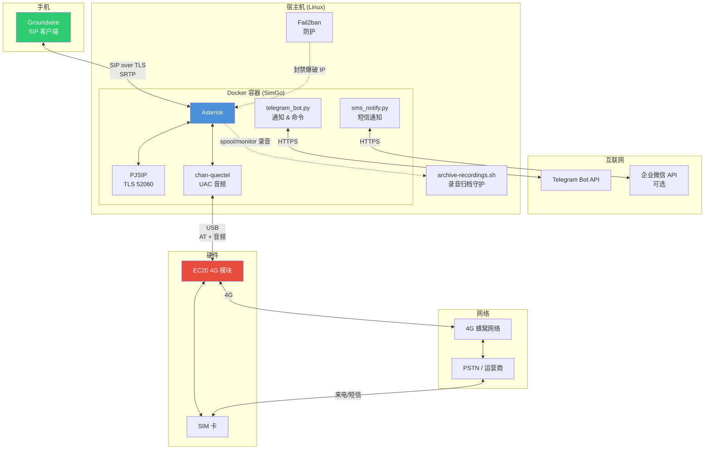

# SimGo

> 让 SIM 卡在家也能远程接打电话 — 基于 EC20 + Asterisk 的容器化模块中继方案

[English](README.en.md) | 中文

[](LICENSE)

> [!WARNING]
> **法律风险声明**
>
> 本项目仅供个人学习研究，仅限部署人使用本人实名办理的 SIM 卡，仅用于个人自用远程接管自己的手机号。
>
> **严禁以下用途：**
> - 向第三方提供电话中继服务
> - 出租、转售本服务
> - 搭建公共 VOIP / SIP 中继服务
> - 用于任何违法活动
>
> 根据《中华人民共和国反电信网络诈骗法》第十四条，禁止非法制造、买卖、提供具有互联网电话违规接入公用电信网络等功能的设备、软件。对外提供电信语音中继服务需取得国家电信业务经营许可，个人不具备该资质。
>
> 使用者违反法律法规的，全部责任由使用者自行承担，与项目作者无关。本项目作者不对任何滥用行为承担法律责任。
>
> 如发现本项目被用于非法用途，作者将积极配合有关部门依法处置。

## 起因

国内 eSIM 基本处于残废状态，换卡需要去营业厅，还经常换卡不成功。国行 iPhone 只能写入 2 张 eSIM 卡，一旦出国旅行就无法写入第 3 张，得删掉一张等回来再去营业厅，非常不方便。iPhone Duo 以后 Apple 超薄机型不再提供双实体卡槽，改为双 eSIM，本项目提前布局远程通话和短信方案。

研究发现把 SIM 卡插在 Quectel EC20 4G 模块里，通过 USB 连接到家里的 Linux 主机（树莓派、小主机、NAS 等），运行容器化的 Asterisk 服务，手机只需一张上网卡，安装 SIP 客户端（如 Groundwire），就能随时随地远程接打电话、收发短信。

由于 iOS 在国内收不到 Telegram 推送，本项目支持企业微信（可选）作为兜底通知渠道。

## 为什么容器化

不同 Linux 发行版的 Asterisk 版本差异很大，手动编译 chan-quectel 容易遇到各种兼容性问题。容器化可以：

- **消除系统差异**：Ubuntu / Debian / Armbian / OpenWrt 都能跑
- **一键部署**：不需要手动安装 Asterisk、编译驱动
- **配置隔离**：配置文件与系统分离，不会污染宿主机
- **易于维护**：升级、回滚、备份都很方便

## 架构



## 硬件要求

### EC20 模块

本项目使用的具体型号：**EC20CEHDLGR08A03M1G**

> **注意**：本项目基于此型号开发测试。其他 EC20 子型号（如 EC20CEFAG-512-SGNS）可能存在适配差异，购买前请确认。

**购买建议**：
- 闲鱼搜索 "EC20 USB 转接板"，约 60 元（模块 + 转接板 + 天线）
- 建议购买全功能的 **EC20CEFAG** 版本（支持通话和短信，但不确保完全适配本项目，也可参考购买作者同样的型号）
- 让商家确认固件版本为 **R08 基线**（`EC20CEFAGR08AXXM4G`），R06 基线对新版中国电信卡支持不佳
- 附赠天线通常信号较弱，建议另购较长天线

### 宿主机

- Linux 系统（Ubuntu / Debian / Armbian 等）
- 7x24 运行（树莓派 4+、Orange Pi、x86 小主机等）
- Docker & Docker Compose
- USB 接口供电充足（**建议模块独立供电**，不要仅依赖 Pi USB 口，尤其是 Pi 3 及更早型号）

## 模块初始化

在部署 SimGo 之前，需要先对 EC20 模块进行初始化配置。**这一步需要手动完成**，请严格按照以下步骤操作。

### 步骤 1：找到 AT 命令端口

EC20 模块通过 USB 连接后会创建多个 ttyUSB 设备：

| 端口 | 用途 |
|------|------|
| ttyUSB0 | 诊断口 |
| ttyUSB1 | 音频/GPS |
| **ttyUSB2** | **AT 命令（通常）** |
| ttyUSB3 | 拨号 |

> **注意**：ttyUSB2 是最常见的 AT 命令端口，但不同硬件/固件可能不同，需要自行确认。

```bash
# 查看 USB 串口设备
ls /dev/ttyUSB*

# 测试 AT 命令响应（逐个尝试）
echo -e "AT\r" > /dev/ttyUSB2
timeout 2 cat /dev/ttyUSB2
# 应返回 OK
```

### 步骤 2：重置模块

使用 minicom 连接到 AT 端口：

```bash
minicom -D /dev/ttyUSB2
```

在 minicom 中依次输入：

```
AT+QPRTPARA=3
```

等待模块重置完成后，输入：

```
AT+CFUN=1,1
```

模块将重启。等待约 30 秒后重新连接 minicom。

### 步骤 3：配置 UAC 数字音频

UAC 数字音频可以显著提高通话质量。在 minicom 中输入：

```
AT+QCFG="usbcfg",0x2C7C,0x0125,1,1,1,1,1,0,1
```

重启模块后（`AT+CFUN=1,1`），在宿主机终端确认音频设备：

```bash
# 方式 1：如果安装了 alsa-utils
aplay -L

# 方式 2：通用方式（无需额外安装）
cat /proc/asound/cards
ls /dev/snd/
```

应看到类似以下输出：

```
hw:CARD=EC20CEHDLG,DEV=0     EC20CEHDLG, USB Audio
```

**记下这个设备名**，部署时需要填入。

### 步骤 4：配置 VoLTE

VoLTE 有助于提高语音通话质量

```
AT+QCFG="ims",1        # 启用 VoLTE
AT+QCFG="ims"          # 检查状态，应显示 "ims",1,1
```

### 步骤 5：配置完后重启

```
AT+CFUN=1,1
```

### 步骤 6：退出 minicom

按下 `Ctrl-A`，然后按 `X`，选择 `Yes` 退出。

### 步骤 7：确认 EC20 的 by-id 设备路径

docker-compose 使用 by-id 路径映射设备，防止 USB 序号漂移：

```bash
ls -l /dev/serial/by-id/
```

找到包含 `Quectel` 和 `EC20` 的条目，记下完整路径，例如：

```
usb-Quectel_Wireless_EC20-if02 -> ../../ttyUSB2
```

这里的 `usb-Quectel_Wireless_EC20-if02` 就是部署时需要填的 AT 端口路径。不同 USB 拓扑下编号可能不同，以实际输出为准。

## 部署

### 前置条件

- Docker 和 Docker Compose 已安装
- EC20 模块已完成上述初始化
- 已创建 Telegram Bot（通过 [@BotFather](https://t.me/BotFather)）
- fail2ban 和 nftables（setup.sh 会自动安装，用于 SIP 爆破防护）

### 快速部署

```bash
git clone https://github.com/myleo1/SimGo.git
cd SimGo
chmod +x setup.sh
./setup.sh
```

部署脚本会引导你填写以下信息：

1. **AT 命令端口**（步骤 7 中找到的 by-id 路径，如 `/dev/serial/by-id/usb-Quectel_Wireless_EC20-if02`）
2. **ALSA 音频设备**（脚本会自动检测可用的 ALSA 设备列表）
3. **PJSIP 用户名和密码**（用户名推荐 `gw_` 前缀 + 随机字符串，如 `gw_7Kx92mQ4`；密码必须强口令，建议 32 位以上随机字符串）
4. **本地局域网段**（CIDR 格式，如 `192.168.1.0/24`）
5. **公网 IP 或域名**（DuckDNS 域名，如 `xxx.duckdns.org`）
6. **Telegram Bot Token 和 Chat ID**
7. **SOCKS5 代理**（可选，国内访问 TG API 通常需要）
8. **企业微信配置**（可选，需先部署 [wechat-work-pusher](https://github.com/myleo1/wechat-work-pusher) 服务端）
9. **DuckDNS Token**（用于签发 TLS 证书和 IP 自动更新）
10. **Let's Encrypt 邮箱**（acme.sh 账户注册用，证书到期前会收到提醒邮件）
11. **通话录音与归档**（可选）：是否启用自动录音、录音格式（`wav49`/`ulaw`）、持久化归档目录、本地保留策略

脚本会自动生成：
- `docker-compose.yml`
- 各配置文件（PJSIP、Quectel、Telegram Bot 等）
- TLS 证书（通过 DuckDNS 签发 Let's Encrypt 证书）
- `duckdns-update.sh`（DuckDNS IP 自动更新脚本，安装 cron 每 5 分钟更新）
- `.simgo-archive.conf`（录音归档配置）
- `spool/contacts.csv`（联系人映射，可选编辑）
- `spool/monitor/`（录音临时中转目录）
- 录音归档 cron：`@reboot` 启动常驻守护 + 每 5 分钟兜底扫描

然后启动服务：

```bash
docker compose up -d
```

查看日志：

```bash
docker compose logs -f
```

看到 `Telegram SMS bot started` 和 `Asterisk Ready` 说明服务正常。

### 使用预构建镜像（可选）

如果你不想本地构建，可以直接使用 GitHub Container Registry 上的预构建镜像：

```bash
# 拉取最新版本（public repo，无需登录）
docker pull ghcr.io/myleo1/simgo:latest

# 或指定版本
docker pull ghcr.io/myleo1/simgo:1.1.0
```

然后在 `docker-compose.yml` 中将 `build` 部分替换为：

```yaml
services:
  simgo:
    image: ghcr.io/myleo1/simgo:latest
```

### GitHub Actions 自动构建

推送 `v*` 标签时自动构建多架构镜像（amd64 + arm64）并发布到 GitHub Container Registry：

```bash
# 发版触发构建
git tag v1.0.0
git push origin v1.0.0
```

Fork 后也可在 Actions 页面手动触发构建。

## 配置说明

### 通知渠道

| 变量 | 说明 | 必填 |
|------|------|------|
| `TG_BOT_TOKEN` | Telegram Bot Token | 是 |
| `TG_CHAT_ID` | Telegram Chat ID | 是 |
| `TG_SOCKS5_PROXY` | SOCKS5 代理 | 否（国内建议填） |
| `WECHAT_WORK_API` | 企业微信 API 地址 | 否 |
| `WECHAT_WORK_TOKEN` | 企业微信 Token | 否 |
| `WECHAT_WORK_TO` | 企业微信接收人 | 否 |

> **企业微信**：作为可选的兜底通知渠道，适用于 iOS 在国内收不到 Telegram 推送的场景。服务端部署参考 [wechat-work-pusher](https://github.com/myleo1/wechat-work-pusher)。

### PJSIP 配置

| 变量 | 说明 |
|------|------|
| `PJSIP_EXTEN` | SIP 用户名（部署时设置） |
| `PJSIP_SECRET` | SIP 密码（部署时设置） |

### 安全配置

本项目默认启用 TLS 和 SRTP 加密通信：

- **SIP 信令加密**：PJSIP over TLS（端口 52060）
- **媒体流加密**：SRTP（加密语音数据）
- **TLS 证书**：部署脚本通过 DuckDNS + acme.sh 自动签发 Let's Encrypt 证书（无需开放 80 端口）
- **Fail2ban 防护**：自动封禁 SIP 爆破 IP（nftables，TCP+UDP 全端口）

> 部署时需提供 DuckDNS 域名和 Token（[duckdns.org](https://www.duckdns.org/) 免费注册）。脚本会自动安装 acme.sh 并完成证书签发。

**⚠️ 强口令要求**：PJSIP 密码是公网 SIP 服务的唯一认证凭据。请务必使用强口令（32 位以上随机字符串）。推荐使用 前缀 + 随机字符作为用户名（例如 `gw_7Kx92mQ4`），避免使用 `1001`、`1000` 等数字分机号。

## 通话录音与归档

### 开关

部署时（setup.sh）可选择是否启用自动录音，**默认启用**。已部署后想关闭/重新开启，改 `docker-compose.yml` 里环境变量 `RECORDING_ENABLED` 为 `no` / `yes`，然后 `docker compose up -d` 重建容器生效，无需改动拨号计划。关闭后录音配套（归档守护 cron、联系人表、格式设置）保留不动，改回 `yes` 即恢复。

### 录音格式

电话 / EC20 音频原生为 **8kHz 窄带**，高于 8kHz 的采样没有意义。部署时可选择：

| 格式 | 编码 | 约每分钟 | 说明 |
|------|------|---------|------|
| `wav49`（默认） | GSM 封装进 WAV | ~100 KB | 电话语音针对性编码，播放器兼容最好 |
| `ulaw` | G.711 8bit | ~470 KB | 8kHz 带宽下无失真，体积偏大 |

### 归档机制

- **自动双向录音**：通话接通后才开始录制（不录振铃/等待音），挂机自动停止
- 录音先落盘本地中转目录 `spool/monitor/`，由宿主机守护（inotifywait）**逐字节校验**后归档到持久化归档目录，按 `YYYY-MM/` 月目录组织
- 归档目录留空（部署时不填）= 不启用归档，录音仅保存在本地
- **持久化归档目录建议**：挂载到本机的 NAS 共享目录（NFS / SMB / WebDAV 挂载点）或本机大容量磁盘目录

> **为什么不在容器里直写归档目录？** 若归档目录为 NAS 挂载点，容器启动时挂载可能尚未就绪（bind mount 会静默绑定一个空目录），且掉线时 NFS `write()` 可能永久阻塞通话。因此录音永远先写本地，由宿主机守护负责归档，归档存储不可用时自动跳过、恢复后在 5 分钟内补传。

### 本地保留策略

归档校验成功后本地录音如何处理（部署时选择）：

| 模式 | 行为 |
|------|------|
| A（默认） | 归档成功即删除本地，归档目录为唯一副本 |
| B | 本地保留 N 天（双保险） |
| C | 本地不超过大小上限 MB（超限删最旧） |
| B+C | 两种条件任一触发即清理 |

### 联系人命名（可选）

`spool/contacts.csv`（UTF-8，`号码,名字` 每行）用于把录音文件名里的号码换成联系人名，未收录的号码回退为号码本身。示例：`20260911-153045_in_张三_13800138000.wav49`

两种方式维护：
1. **手工编辑** `spool/contacts.csv`（参考 `config/contacts.csv.example` 模板）
2. **从 iPhone 通讯录导入**（一次性，兼容 Apple / 安卓导出的 vCard 写法，自动生成"去 `+86` 前缀"变体行（手机号段）提高匹配率）：
   - 电脑浏览器登录 [iCloud 通讯录](https://www.icloud.com/contacts)，全选 → 导出 vCard（`.vcf`）
   - 执行：`python3 scripts/vcard_to_csv.py 你的通讯录.vcf`
   - 默认输出覆盖 `<部署目录>/spool/contacts.csv`

> 录音归档日志与故障排查：`logs/recordings-archive.log`。卸载 SimGo 会删除本地录音与联系人表，**归档目录不受影响**。
>
> `logs/` 下的日志由宿主机 `logrotate` 每日自动轮转：录音归档日志保留 7 份、Asterisk（`messages.log` / `queue_log`）保留 14 份，均 gzip 压缩（配置 `/etc/logrotate.d/simgo`，随卸载删除）。

## 使用说明

### Telegram Bot 命令

| 命令 | 说明 |
|------|------|
| `/start` | 打开主菜单 |
| `/help` | 查看帮助 |
| `/send <号码> <内容>` | 发送短信 |

Bot 支持：
- 短信接收通知（带回复按钮）
- 来电通知
- 模块状态查看
- 模块远程重启

### Groundwire 配置

#### 为什么推荐 Groundwire

本项目需要一个能在后台持续接收来电的 SIP 客户端。iOS 对此有严格限制：

- **来电推送机制**：iOS 的 VoIP 推送（PushKit）必须配合 CallKit 使用（iOS 13+ 起强制要求）。没有 CallKit 的 VoIP 推送会被系统拒绝，App 会被终止。
- **CallKit 的门槛**：自建 iOS SIP 客户端需要：
  1. Apple Developer Program 会员（$99/年）
  2. 在 Apple Developer Portal 申请 **VoIP Services Certificate（.p12 格式）**，而非普通的 APNs 推送证书（.p8）
  3. 集成 PushKit + CallKit 框架，在 PushKit 回调中立即调用 `CXCallObserver` 报告来电，否则 App 会被系统终止
  4. 维护一个常驻后台的 SIP 连接

[Groundwire](https://apps.apple.com/app/groundwire-sip-softphone/id397417696)（[Android](https://play.google.com/store/apps/details?id=cz.acrobits.softphone.aliengroundwire)）是一款成熟的商业 SIP 客户端，已经完整实现了上述所有能力：

- **CallKit 集成**：来电时自动触发系统级来电界面（锁屏、后台、勿扰模式下都能响铃）
- **常驻后台**：保持 SIP 注册状态，接收服务器推送后立即调用 APNs 发起 VoIP 推送，唤醒 CallKit 界面
- **无需开发者账号**：不需要 $99/年的 Apple Developer Program，也不需要自己申请 VoIP 证书

> 如果你有 iOS 开发能力且愿意自建 SIP 客户端，可以参考 Groundwire 的 CallKit 实现方式，但需要注意 VoIP Services Certificate（.p12）的申请和维护成本。

1. 新建 SIP 账号
2. 用户名：填写 `PJSIP_EXTEN`
3. 密码：填写 `PJSIP_SECRET`
4. 域名：填写 DuckDNS 域名（如 `your-domain.duckdns.org`）
5. 传输协议：Account → Advanced Settings → Transport Protocol → 选择 **TLS (SIPS)**
6. 端口：填写 `52060`
7. SRTP 加密：Account → Advanced Settings → Secure Calls → 打开 **Incoming Calls** 和 **Outgoing Calls**
8. 保存后等待注册成功

> Groundwire 需要接受证书。首次连接时会弹出证书确认提示，选择"接受"即可。

**测试推送是否正常**：Groundwire 内置了 Push Notification 测试功能。进入 Settings → Push Notification，点击测试按钮，等待几秒如果提示"Push Test 来电"则说明 CallKit 推送功能正常。如果收不到，检查 Groundwire 的后台刷新权限是否被系统关闭。

**接听来电**：完全关闭 Groundwire → 用另一部手机拨打 EC20 号码 → Callkit触发  → 直接接听

### 防火墙放行

如宿主机启用了防火墙，需要放行以下端口：

| 端口 | 协议 | 用途 |
|------|------|------|
| 52060 | TCP | PJSIP TLS 信令 |
| 42077-42126 | UDP | RTP/SRTP 媒体流（50 个端口） |

### 拨打测试

```bash
# 查看模块状态
docker exec simgo asterisk -rx "quectel show devices"
```

## 常见问题

### Q: 来电 Groundwire 不响？

1. 先用 Groundwire 内置的 Push Notification 测试（Settings → Push Notification → 测试），确认推送功能正常
2. 确认 Groundwire 已注册成功（状态显示 Registered）
3. 确认 Groundwire 没有被手机系统杀进程（检查"后台 App 刷新"是否开启）
4. 检查防火墙是否放行了 52060/TCP 和 42077-42126/UDP

### Q: 通话没有声音？

1. 检查 `/dev/snd` 是否正确挂载
2. 确认容器以 `privileged: true` 运行
3. 确认 UAC 配置正确（`cat /proc/asound/cards` 能看到声卡）
4. 检查宿主机没有其他程序（如 PulseAudio）独占声卡

### Q: AT 命令端口找不到？

不同模块/固件的端口分配可能不同。用以下方法逐个测试：

```bash
for port in /dev/ttyUSB*; do
    echo "Testing $port..."
    echo -e "AT\r" > $port 2>/dev/null
    timeout 2 cat $port 2>/dev/null
done
```

## 目录结构

```
SimGo/
├── config/                 # Asterisk 配置文件模板
│   ├── pjsip.conf
│   ├── extensions.conf
│   ├── extensions_custom.conf
│   ├── quectel.conf
│   ├── modules.conf
│   ├── rtp.conf
│   └── contacts.csv.example # 联系人映射模板（复制为 spool/contacts.csv）
├── scripts/                # 通知、Bot 与录音脚本
│   ├── sms_notify.py
│   ├── telegram_bot.py
│   ├── bot.conf            # Bot 配置文件（模板）
│   ├── archive-recordings.sh # 录音归档守护（--watch/--scan）
│   └── vcard_to_csv.py     # iPhone 通讯录 vCard → contacts.csv 导入工具
├── docker/                 # Docker 相关文件
│   ├── Dockerfile
│   └── docker-compose.yml
├── fail2ban/               # Fail2ban 配置模板
│   ├── filter.d/
│   │   └── asterisk-pjsip.conf
│   └── jail.d/
│       └── asterisk-pjsip.local
├── .github/                # GitHub Actions
│   └── workflows/
│       └── build.yml
├── .simgo-archive.conf      # 录音归档配置（setup.sh 生成，git 忽略）
├── setup.sh                # 交互式部署脚本
├── uninstall.sh            # 卸载脚本
├── spool/                  # 运行时数据（git 忽略）
│   ├── contacts.csv        # 联系人映射（录音文件名用）
│   └── monitor/            # 录音临时中转目录
├── docs/                   # 项目文档
│   ├── REQUIREMENTS.md
│   ├── DESIGN.md
│   ├── TASKS.md
│   └── PROMPT-RECORD.md
├── LICENSE                 # GPL v2 许可证
└── README.md
```

## 来源与致谢

本项目基于以下开源项目和教程：

- **[myth.cx - Asterisk + EC20 实现短信收发+语音通话+网络代理](https://myth.cx/p/asterisk-ec20/)** — 核心教程，详细讲解了 EC20 + Asterisk 的配置流程
- **[mccding/NasAnySim](https://github.com/mccding/NasAnySim)** — TLS 证书自动管理方案（DuckDNS DNS-01 + HTTP-01 + 自签名优先级链）、DuckDNS IP 更新脚本
- **[kafuneri/asterisk-docker-iax](https://github.com/kafuneri/asterisk-docker-iax)** — Docker 容器化方案参考，环境变量注入和模板系统的设计灵感
- **[IchthysMaranatha/asterisk-chan-quectel](https://github.com/IchthysMaranatha/asterisk-chan-quectel)** — 原始 chan-quectel 驱动，支持 UAC 数字音频
- **[missing233/asterisk-chan-quectel-lts](https://github.com/missing233/asterisk-chan-quectel-lts)** — LTS 分支，改进了 UAC 媒体路径和稳定性
- **[myleo1/asterisk-chan-quectel-lts](https://github.com/myleo1/asterisk-chan-quectel-lts)** — 修复了 swap hold/unhold bug（同一号码同时 2 通电话场景）
- **[myleo1/wechat-work-pusher](https://github.com/myleo1/wechat-work-pusher)** — 企业微信消息推送服务端
- **[blog.wsl.moe](https://blog.wsl.moe/2023/03/%E5%AE%89%E8%A3%85%E5%9F%BA%E4%BA%8E-quectel-ec20-%E6%A8%A1%E5%9D%97%E7%9A%84%E7%9F%AD%E4%BF%A1%E5%8F%8A%E8%AF%AD%E9%9F%B3%E8%BD%AC%E5%8F%91%E6%9C%8D%E5%8A%A1/)** — EC20 短信及语音转发服务安装参考
- **[blog.sparktour.me](https://blog.sparktour.me/posts/2022/10/08/quectel-ec20-asterisk-freepbx-gsm-gateway/)** — EC20 + Asterisk + FreePBX 配置参考

## License

[GPL v2](LICENSE)
